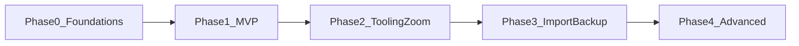

# Development Roadmap — PageBound Notes

**Last updated:** July 6, 2026

This document is the canonical implementation sequencing guide for PageBound Notes. It expands the high-level development plan in [Section 9 of the Product Spec](Pagebound%20Notes%20Project%20Spec.md#91-phase-0--foundations) into actionable phases with deliverables, exit criteria, and dependencies.

**Related documents:**

- [README](../README.md) — project overview and getting started
- [Pagebound Notes Project Spec](Pagebound%20Notes%20Project%20Spec.md) — requirements, architecture, and data model

---

## How to Use This Document

1. Read this roadmap before starting implementation work.
2. Confirm the current phase in the [Phase Status](#phase-status) table below.
3. Work within the active phase only — do not skip ahead to later deliverables.
4. Implement each feature as a **vertical slice**: Model → Repository → ViewModel → View.
5. Verify all **exit criteria** for the phase before marking it complete and advancing.
6. If scope changes during implementation, update the Product Spec (what) and this roadmap (when).

---

## Phase Status

| Phase | Name | Status |
|-------|------|--------|
| 0 | Foundations | Not started |
| 1 | MVP: Local Notebooks and Pagination | Not started |
| 2 | Tooling, Content Layers, and Zoom | Not started |
| 3 | Import, Backup, and Cloud Export | Not started |
| 4 | Advanced Features | Not started |

Update the **Status** column as work progresses (e.g., `In progress`, `Complete`).

---

## Phase Overview

Each phase builds on the previous one. Phases are sequential — complete exit criteria before starting the next phase.

---

## Phase 0 — Foundations

**Goal:** Establish a runnable app shell with persistence wired and ready for feature development.

**Spec reference:** [§6 Architecture](Pagebound%20Notes%20Project%20Spec.md#6-architecture-swiftui--mvvm), [§7 Data Model and Persistence](Pagebound%20Notes%20Project%20Spec.md#7-data-model-and-persistence)

**Key modules:** Core (Models, Persistence, Services), App shell

**Dependencies:** None

### Deliverables

- [ ] Create Xcode project targeting iPad only (iPadOS 16+ deployment target)
- [ ] Set up module folder structure per architecture spec:
  - `App/`
  - `Modules/` (Library, Book, Page, ZoomWindow, ExportImport, CloudBackup)
  - `Core/Models/`, `Core/Persistence/`, `Core/Services/`
- [ ] Implement domain models:
  - `Folder` — id, name, parentFolderId, createdAt, updatedAt
  - `Book` — id, folderId, title, coverStyle, pageSize, defaultTemplateId, autoAdvanceEnabled, timestamps
  - `Page` — id, bookId, index, templateId, orientation, strokeBlobId, objectsBlobId, timestamps
  - `Template` — id, type, lineSpacing, gridSize, backgroundColor
- [ ] Choose and implement persistence layer (Core Data or SwiftData with SQLite)
- [ ] Implement repositories:
  - `LibraryRepository` — CRUD for folders and books
  - `BookRepository` — book-level operations
  - `PageRepository` — page-level reads/writes, stroke serialization stubs
- [ ] Set up dependency injection container or factory for ViewModel initialization
- [ ] Create minimal app entry point that launches to an empty library view placeholder

### Exit Criteria

- App builds and launches on iPad simulator or device
- Domain models persist to local storage
- Empty library state survives app relaunch (kill and reopen)
- Module folder structure matches the planned layout in the README

---

## Phase 1 — MVP: Local Notebooks and Pagination

**Goal:** Deliver a usable handwriting notebook with basic tools, page navigation, and PDF export.

**Spec reference:** [§4.1 Library](Pagebound%20Notes%20Project%20Spec.md#41-library-and-organization), [§4.2 Pages](Pagebound%20Notes%20Project%20Spec.md#42-pages-and-pagination), [§4.3 Handwriting (basic)](Pagebound%20Notes%20Project%20Spec.md#43-handwriting-and-pen-tools), [§4.7 PDF Export](Pagebound%20Notes%20Project%20Spec.md#47-pdf-import-and-export), [§5.2 Reliability](Pagebound%20Notes%20Project%20Spec.md#52-reliability)

**Key modules:** Library, Book, Page, ExportImport (PDF export only)

**Dependencies:** Phase 0 complete

### Deliverables

#### Library

- [ ] `LibraryViewModel` and `LibraryView` — list folders and books
- [ ] Create, rename, move, and delete folders
- [ ] Create, rename, move, duplicate, and delete books
- [ ] Basic sorting by name and date

#### Book and Pages

- [ ] `BookViewModel` and `BookView` — paginated page canvas
- [ ] `PageViewModel` and `PageView` — single page rendering
- [ ] Basic page templates: blank, college ruled, wide ruled, dotted grid
- [ ] Fixed page size with visible border and optional safe-margin lines
- [ ] Add page at end; delete page with confirmation
- [ ] `PageThumbnailStripView` — scrollable thumbnail navigation

#### PencilKit Integration

- [ ] `CanvasView: UIViewRepresentable` wrapping `PKCanvasView`
- [ ] Coordinator implementing `PKCanvasViewDelegate` for stroke change callbacks
- [ ] Basic pen tool and eraser
- [ ] Palm rejection via `drawingPolicy`
- [ ] ViewModel owns `PKDrawing`; canvas synchronizes state both ways

#### Persistence and Reliability

- [ ] Autosave on stroke completion, page transitions, and app backgrounding
- [ ] Transactional writes for crash-safe persistence
- [ ] Stroke data serialized to file-based blobs referenced by Page entities

#### PDF Export

- [ ] `PDFExportService` — export current page as single-page PDF
- [ ] Export entire book as multi-page PDF via PDFKit
- [ ] Export runs on background queue; UI remains responsive
- [ ] Strokes and content clipped precisely to page bounds

### Exit Criteria

- User can create a folder, create a book inside it, and open the book
- User can write notes with Apple Pencil on paginated pages with visible borders
- User can navigate between pages via the thumbnail strip
- Notes persist across app relaunch without data loss
- User can export the full book as a PDF with handwriting contained within page boundaries
- PDF export does not block the UI

---

## Phase 2 — Tooling, Content Layers, and Zoom

**Goal:** Reach feature parity with core writing workflows, including the full tool catalog, content overlays, and the zoom window with auto-advance.

**Spec reference:** [§4.3 Handwriting (full)](Pagebound%20Notes%20Project%20Spec.md#43-handwriting-and-pen-tools), [§4.4 Zoom Window](Pagebound%20Notes%20Project%20Spec.md#44-zoom-window-and-auto-advance), [§4.5 General Zoom](Pagebound%20Notes%20Project%20Spec.md#45-general-zoom-and-navigation), [§4.6 Text, Images, Shapes](Pagebound%20Notes%20Project%20Spec.md#46-text-images-and-shapes)

**Key modules:** Page (tool palette), ZoomWindow, Book (page management)

**Dependencies:** Phase 1 complete

### Deliverables

#### Full Tool Catalog

- [ ] Expand pen tools to match Apple Markup catalog:
  - Pen / monoline
  - Marker / highlighter (semi-transparent)
  - Pencil (sketch texture)
  - Crayon (rough texture)
  - Fountain pen (pressure-sensitive)
  - Reed pen (angle-dependent; feature-detect iPadOS 26+)
  - Watercolor brush (soft, blended strokes)
- [ ] Adjustable stroke width, opacity, and color
- [ ] Preset sizes and color swatches; user-saved presets
- [ ] Bitmap and vector eraser modes
- [ ] Lasso selection, shapes tool, ruler, and laser pointer

#### Content Overlays

- [ ] Text boxes with font, size, color, bold/italic; movable and resizable
- [ ] Image insertion from Photos, Files, and drag-and-drop with scale/rotate handles
- [ ] Shapes: rectangles, circles, arrows, straight lines with snap-to-straight

#### Zoom Window

- [ ] `ZoomWindowViewModel` and `ZoomWindowView`
- [ ] Magnified writing strip over the current page
- [ ] Miniature page preview showing context
- [ ] Auto-advance: visual indicator (blue zone) near right edge of zoom pane
- [ ] Horizontal sliding when writing in the advance zone
- [ ] At page margin, move down by configurable return height aligned to template line spacing
- [ ] Auto-advance on/off toggle at book level
- [ ] Return height configuration per template type

#### Page Management and Navigation

- [ ] Add page between existing pages
- [ ] Duplicate page
- [ ] Reorder pages via drag-and-drop in thumbnail strip
- [ ] Additional templates: fine/coarse graph paper, Cornell notes, music staff, checklists, planners
- [ ] Global pinch-to-zoom and pan on page canvas
- [ ] Fit-page-to-screen gesture

### Exit Criteria

- All Markup-style pen tools are functional with adjustable parameters
- Eraser, lasso, shapes, and ruler work correctly on the canvas
- Text boxes and images can be placed, moved, and resized on pages
- Zoom window provides magnified writing with miniature page context
- Auto-advance moves horizontally along a line and vertically at page margins on ruled and graph templates
- Auto-advance can be disabled per book
- Pages can be added, duplicated, deleted, and reordered via the thumbnail strip
- Pinch-zoom, pan, and fit-to-screen work smoothly

---

## Phase 3 — Import, Backup, and Cloud Export

**Goal:** Enable data portability through PDF import, local backup/restore, and optional cloud export.

**Spec reference:** [§4.7 PDF Import and Export (full)](Pagebound%20Notes%20Project%20Spec.md#47-pdf-import-and-export), [§4.8 Storage and Backup](Pagebound%20Notes%20Project%20Spec.md#48-storage-and-backup), [§8.2 Google Drive API](Pagebound%20Notes%20Project%20Spec.md#82-google-drive-api-optional-backup), [§8.3 Share Sheet](Pagebound%20Notes%20Project%20Spec.md#83-ios-share-sheet--files-integration)

**Key modules:** ExportImport, CloudBackup

**Dependencies:** Phase 2 complete

### Deliverables

#### PDF Import

- [ ] `PDFImportService` — import PDF into a new book
- [ ] Each PDF page rendered as page background with PencilKit annotation layer on top
- [ ] Preserve page order and dimensions where possible

#### Extended Export

- [ ] Export entire folder as single concatenated PDF
- [ ] Export entire folder as zip archive of per-book PDFs

#### Local Backup and Restore

- [ ] `BackupService` — export compressed `.pbn` archive containing metadata, strokes, templates, and assets
- [ ] Restore operation reads `.pbn` and reconstructs folders, books, and pages
- [ ] Round-trip integrity: backup → restore produces identical library state

#### Share Sheet Integration

- [ ] `ShareSheetService` using `UIActivityViewController` for PDF and backup export
- [ ] Document picker integration via `UIDocumentPickerViewController` for import and restore

#### Google Drive (Optional)

- [ ] `DriveBackupService` — OAuth 2.0 authentication (Google Sign-In or web flow)
- [ ] Store OAuth tokens securely in Keychain
- [ ] Upload backup archives and PDFs to user-chosen Drive folder
- [ ] Respect API quotas; handle rate limits gracefully
- [ ] List and download saved backups for restore (if implemented)

### Exit Criteria

- User can import a PDF and annotate each page with Apple Pencil
- User can export a folder as PDF or zip of per-book PDFs
- User can create a `.pbn` backup and restore it with no data loss
- Share sheet exports PDFs and backups to Files, iCloud Drive, and other installed providers
- User-initiated Google Drive upload works within free API quotas
- All cloud operations require explicit user action; no background uploads

---

## Phase 4 — Advanced Features

**Goal:** Add power-user capabilities, search, and accessibility polish.

**Spec reference:** [§4.5 Split View](Pagebound%20Notes%20Project%20Spec.md#45-general-zoom-and-navigation), [§4.9 Search](Pagebound%20Notes%20Project%20Spec.md#49-search-later-phase), [§5.5 Accessibility](Pagebound%20Notes%20Project%20Spec.md#55-accessibility)

**Key modules:** Library (search), Page (OCR), Book (split view), Core (templates)

**Dependencies:** Phase 3 complete

### Deliverables

#### Search

- [ ] Basic search across book titles, folder names, and tags
- [ ] Search results navigate directly to matching items

#### Handwriting OCR Search

- [ ] On-device OCR using Vision/Core ML over rendered page images
- [ ] Index recognized text per page
- [ ] Search handwriting content and navigate to relevant pages

#### Split View and Multi-Window

- [ ] Side-by-side view for two books or two pages within a book
- [ ] Stable layout across orientation changes

#### Customization

- [ ] User-defined page templates with configurable line spacing, grid size, and colors
- [ ] Template creation and saving for reuse across books

#### Accessibility

- [ ] VoiceOver support for library navigation, book opening, and page browsing
- [ ] Dynamic Type support for UI text components
- [ ] High-contrast mode compatibility for tool palette and library views
- [ ] Accessibility audit and remediation pass

### Exit Criteria

- Library search returns and navigates to matching books and folders
- Handwriting OCR indexes page content and search navigates to correct pages
- Split view displays two books or pages side by side without layout issues
- User can create and apply custom templates
- VoiceOver can navigate the full library-to-page workflow
- UI respects Dynamic Type and high-contrast settings

---

## Contributor Workflow

Follow this process for all implementation work:

1. **Check the phase status table** at the top of this document. Only work on deliverables in the current active phase.

2. **Pick a module vertical slice.** For example, if implementing library CRUD in Phase 1:
   - Model: ensure `Folder` and `Book` entities are complete
   - Repository: implement `LibraryRepository` methods
   - ViewModel: build `LibraryViewModel` with `@Published` state and business logic
   - View: create `LibraryView` bound to the ViewModel

3. **Implement and test** the slice end to end before moving to the next slice within the same phase.

4. **Verify exit criteria.** Run through every exit criterion for the phase. Do not advance until all are met.

5. **Update documentation** if scope changes:
   - Requirements changes → [Product Spec](Pagebound%20Notes%20Project%20Spec.md)
   - Sequencing or deliverable changes → this roadmap
   - Update the phase status table when a phase is complete

6. **Mark deliverables** by checking off items in this document as they are completed.

---

## Implementation Risks and Mitigations

| Risk | Impact | Mitigation |
|------|--------|------------|
| **Google Drive API quota or policy changes** | Cloud backup feature breaks or becomes costly | Keep Drive integration optional; monitor official usage limits documentation; fall back to share sheet export |
| **OS feature variance** | Advanced tools (reed pen, fountain pen behavior) unavailable on older iPadOS | Feature-detect at runtime; gracefully degrade to available tool set; document minimum OS for each tool |
| **Performance with large books** | Slow page loading, laggy scrolling, high memory use | Lazy-load pages on demand; efficient stroke serialization; page-level caching; background PDF rendering |
| **Zoom window UX complexity** | Users confused by auto-advance behavior | Provide onboarding tutorial; inline help tooltips; easy per-book toggle to disable auto-advance; follow GoodNotes UX patterns |
| **PencilKit + SwiftUI bridging** | State sync issues between UIKit canvas and SwiftUI bindings | Use Coordinator pattern consistently; ViewModel owns drawing state; thorough testing of save/load cycles |
| **PDF export clipping accuracy** | Handwriting cut across page boundaries in exported PDFs | Fixed page borders with visible safe margins; test export against all template types; clip strokes to page bounds in export pipeline |

---

## Change Log

| Date | Change |
|------|--------|
| 2026-07-06 | Initial roadmap — Phases 0–4 with deliverables and exit criteria |
