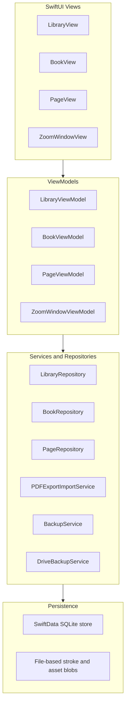

# PageBound Notes

**Free, handwriting-first, iPad-native note-taking with paginated pages and PDF export.**

PageBound Notes is an iPad-only note-taking app built for Apple Pencil. It combines the page-oriented structure of GoodNotes with the simplicity of Apple Notes, while remaining completely free and local-first. Students can take course notes on ruled pages and export assignment-ready PDFs; anyone can import lecture slides, annotate them, and organize content in unlimited folders and books—all without a subscription or custom backend.

**Status:** Phase 0 complete — signed off. App shell, domain models, SwiftData persistence, repositories, and dependency injection are implemented. Phase 1 not started.

---

## Table of Contents

- [Features](#features)
- [Architecture](#architecture)
- [Project Structure](#project-structure)
- [Requirements](#requirements)
- [Getting Started](#getting-started)
- [Documentation](#documentation)
- [Development Status](#development-status)
- [Non-Goals and Constraints](#non-goals-and-constraints)
- [Contributing](#contributing)
- [Privacy](#privacy)

---

## Features

### Library and Organization

- Unlimited nested folders and books, bounded only by device storage
- Create, rename, move, duplicate, and delete folders and books
- Sort by name or date; filter by tag or template type
- Book metadata: title, cover style, default page size, default template, auto-advance settings

### Pages and Pagination

- Fixed physical page sizes (A4, US Letter, custom) with portrait or landscape orientation
- Visible page borders and optional safe-margin lines for precise PDF export clipping
- Templates: blank, college ruled, wide ruled, dotted grid, graph paper, Cornell notes, music staff, checklists, and planners
- Add, duplicate, delete, and reorder pages via a scrollable thumbnail strip

### Handwriting and Tools

- Low-latency Apple Pencil input via PencilKit
- Full Markup-style tool catalog: pen, marker, pencil, crayon, fountain pen, reed pen, and watercolor brush
- Adjustable stroke width, opacity, and color with user-saved presets
- Eraser (bitmap and vector), lasso selection, shapes, ruler, and laser pointer
- Palm rejection and configurable pencil/finger input policies

### Zoom Window and Navigation

- GoodNotes-style zoom window with magnified writing strip and miniature page preview
- Auto-advance when writing near the page edge, with configurable return height per template
- Pinch-to-zoom, pan, and fit-page-to-screen on each canvas
- Optional split view for two books or pages side by side (Phase 4)

### Text, Images, and Shapes

- Movable, resizable text boxes with basic rich text (bold, italic)
- Image insertion from Photos, Files, or drag-and-drop with scale and rotate handles
- Shapes: rectangles, circles, arrows, and straight lines with snap-to-straight

### PDF Import and Export

- Export a single page, an entire book, or an entire folder as PDF
- Import PDFs into a new book with each page rendered as background and a PencilKit annotation layer on top

### Storage and Backup

- All primary content stored locally in the app sandbox
- Export and restore compressed `.pbn` backup archives
- Optional user-initiated cloud backup via the system share sheet or Google Drive integration

### Out of Scope (Initial Releases)

- Real-time cross-device sync with a custom backend
- Non-Apple platforms (Android, Web, Windows)
- Multi-user collaborative editing
- Handwriting-to-text search (planned for Phase 4)

---

## Architecture

PageBound Notes uses **SwiftUI + MVVM**, separating concerns into Model, ViewModel, and View layers. ViewModels expose `@Published` state for SwiftUI views and contain business logic, navigation coordination, and persistence interactions. Complex UIKit components (PencilKit) are bridged into SwiftUI via `UIViewRepresentable`.



**Key principles:**

- ViewModels remain UI-framework agnostic (no SwiftUI imports)
- PencilKit is integrated via a `UIViewRepresentable` wrapper around `PKCanvasView`
- Dependency injection provides repositories and services into ViewModels for testability
- Large binary objects (stroke archives, images) are stored as file-based blobs with database references

For full module definitions, data model, and integration patterns, see the [Product Spec](Documents/Pagebound%20Notes%20Project%20Spec.md).

---

## Project Structure

The repository includes an Xcode project for Phase 0 foundations.

```
PageBoundNotes/
├── App/
├── Modules/
│   ├── Library/       # Folder and book library
│   ├── Book/          # Book shell, thumbnail strip
│   ├── Page/          # Canvas, templates, tool palette
│   ├── ZoomWindow/    # Magnified writing and auto-advance
│   ├── ExportImport/  # PDF and .pbn backup
│   └── CloudBackup/   # Share sheet, optional Google Drive
├── Core/
│   ├── Models/
│   ├── Persistence/
│   └── Services/
└── Documents/         # Product spec, roadmap, and guidelines
```

---

## Requirements

| Category | Requirement |
|----------|-------------|
| **Hardware** | iPad with Apple Pencil support (Pencil 1, Pencil 2, or later) |
| **Operating System** | iPadOS 17+ baseline; newer Markup tools (e.g., reed pen) are feature-detected on supported OS versions |
| **Development** | Xcode (latest stable recommended), Apple Developer account for on-device testing |
| **Frameworks** | SwiftUI, PencilKit, PDFKit, SwiftData |

---

## Getting Started

1. **Clone the repository**

   ```bash
   git clone <repository-url>
   cd Pagebound-Notes
   ```

2. **Read the product spec** — [Documents/Pagebound Notes Project Spec.md](Documents/Pagebound%20Notes%20Project%20Spec.md) is the canonical source of truth for requirements, architecture, and data model.

3. **Read the development roadmap** — [Documents/Development Roadmap.md](Documents/Development%20Roadmap.md) defines phased deliverables, exit criteria, and contributor workflow. Start at Phase 0.

4. **Configure signing** — Open `PageBoundNotes.xcodeproj` in Xcode and confirm **Signing & Capabilities** has a Development Team selected at the project level (applies to both the app and test targets). Team selection is per-developer in Xcode and is not committed to the repository.

5. **Open and build** — Select an iPad simulator and run (⌘R). Requires iPadOS 17+ deployment target.

6. **Running tests** — Run unit tests with ⌘U in Xcode, or:

   ```bash
   xcodebuild -project PageBoundNotes.xcodeproj -scheme PageBoundNotes -destination 'platform=iOS Simulator,name=iPad (A16)' test
   ```

7. **Google Drive setup** — *Coming in Phase 3.* Requires OAuth client configuration and Keychain storage for tokens.

---

## Documentation

| Document | Purpose |
|----------|---------|
| [Pagebound Notes Project Spec](Documents/Pagebound%20Notes%20Project%20Spec.md) | Canonical requirements, architecture, data model, and integrations |
| [Development Roadmap](Documents/Development%20Roadmap.md) | Phased deliverables, exit criteria, and contributor workflow |
| [Notes KB Guidelines](Documents/Notes%20KB%20Guidelines.md) | Optional — Obsidian vault conventions for extended project notes |

---

## Development Status

**Current phase:** Phase 0 complete — signed off. Phase 1 not started.

| Phase | Summary |
|-------|---------|
| **Phase 0** | App shell, domain models, SwiftData persistence, repositories, DI — **complete** |
| **Phase 1** | MVP: library, paginated pages, basic PencilKit, PDF export |
| **Phase 2** | Full tooling, zoom window with auto-advance, text/images/shapes |
| **Phase 3** | PDF import, local backup/restore, cloud export |
| **Phase 4** | Search, handwriting OCR, split view, accessibility |

For deliverables, exit criteria, dependencies, and the contributor workflow, see the [Development Roadmap](Documents/Development%20Roadmap.md).

---

## Non-Goals and Constraints

- No real-time cross-device sync or custom backend
- No support for non-Apple platforms
- No subscription model — the app is free
- Cloud interactions are limited to optional, user-initiated backup and export
- Must comply with Apple App Store guidelines and framework usage policies

---

## Contributing

1. Create a feature branch from `main`.
2. Follow MVVM conventions: ViewModels without SwiftUI imports, dependency injection, and small composable views.
3. Update [Documents/Pagebound Notes Project Spec.md](Documents/Pagebound%20Notes%20Project%20Spec.md) when requirements or architecture change.
4. Follow [Documents/Development Roadmap.md](Documents/Development%20Roadmap.md) for implementation sequencing — complete exit criteria for the current phase before advancing.
5. Implement work as vertical slices: Model → Repository → ViewModel → View.

A license has not yet been chosen. Contribution terms will be clarified when one is added.

---

## Privacy

All note content is stored locally in the app sandbox by default. No data is uploaded without explicit user action. Cloud export and backup operations require user consent. Google OAuth tokens, when used, are stored securely in the Keychain and used only for user-initiated backup operations.
