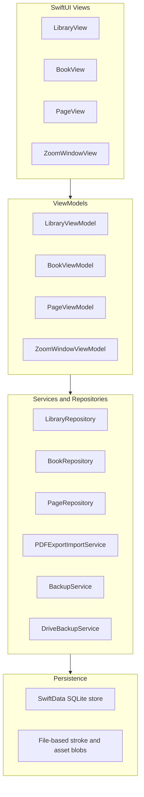

# PageBound Notes

**Free, handwriting-first, iPad-native note-taking with paginated pages and PDF export.**

PageBound Notes is an iPad-only note-taking app built for Apple Pencil. It combines the page-oriented structure of GoodNotes with the simplicity of Apple Notes, while remaining completely free and local-first. Students can take course notes on ruled pages and export assignment-ready PDFs; anyone can organize content in unlimited folders and books—all without a subscription or custom backend.

**Status:** Phase 2 in progress — **Phase 2 Part 3 (Zoom Window) remediated September 2, 2026** (device re-QA pending); implemented September 1, 2026. Part 2 signed off July 21, 2026; Part 1 signed off July 10, 2026. Phase 1 signed off July 8, 2026.

---

## Table of Contents

- [Features](#features)
- [Architecture](#architecture)
- [Project Structure](#project-structure)
- [Requirements](#requirements)
- [Getting Started](#getting-started)
- [Documentation](#documentation)
- [Development Status](#development-status)
- [Non-Goals and Constraints](#non-goals-and-constraints)
- [Contributing](#contributing)
- [Privacy](#privacy)

---

## Features

### Shipped (Phases 0–2 Parts 1–3)

#### Library and Organization

- Unlimited nested folders and books, bounded only by device storage
- Create, rename, move, duplicate, and delete folders and books
- Sort by name or date
- Book metadata: title, cover style, default page size, default template

#### Pages and Pagination

- Fixed physical page sizes (A4, US Letter) with portrait or landscape orientation
- Visible page borders and optional safe-margin lines for precise PDF export clipping
- Templates: blank, college ruled, wide ruled, dotted grid
- Add page at end; delete page with confirmation
- Scrollable thumbnail strip navigation

#### Handwriting and Tools

- Low-latency Apple Pencil input via PencilKit
- Full Markup-style tool catalog: pen, marker, pencil, crayon, fountain pen, reed pen (OS-gated), and watercolor brush
- Adjustable stroke width, opacity, and color with user-saved presets
- Pixel and object eraser, lasso selection, stroke-committed shapes, ruler, and laser pointer
- Palm rejection and configurable pencil/finger input policies
- Apple Pencil double-tap honors system Settings

#### Text, Images, and Shapes

- Movable, resizable text boxes with basic rich text (bold, italic)
- Image insertion from Photos, Files, or drag-and-drop with scale and rotate handles
- Object-layer shapes: rectangles, circles, arrows, and straight lines with snap-to-straight
- Images render under ink; text and shapes above ink in export and thumbnails

#### PDF Export

- Export current page or entire book as PDF
- Background rendering; strokes and overlays clipped to page bounds

#### Storage

- All primary content stored locally in the app sandbox

#### Zoom Window

- Magnified writing strip with miniature page preview
- Blue-zone auto-advance (horizontal slide, vertical return height aligned to template line spacing)
- Per-book auto-advance toggle; configurable return height per template type
- Zoom level slider; inline help tip

### Planned (Phase 2 remainder and later)

| Area | Phase |
|------|-------|
| Page insert-between, duplicate, reorder via thumbnail strip | 2 |
| Additional templates (fine/coarse graph, Cornell, music staff, checklist, planner) | 2 |
| Pinch-to-zoom, pan, and fit-page-to-screen | 2 |
| Immersive writing chrome (optional hide/show nav and thumbnail strip) | 2 |
| Filter by tag or template type | 2+ |
| PDF import into new books | 3 |
| Export folder as PDF or zip; `.pbn` backup and restore | 3 |
| Share sheet integration for export and import | 3 |
| Optional Google Drive backup | 3 |
| Library search; handwriting OCR search | 4 |
| Split view for two books or pages | 4 |
| Custom user-defined templates | 4 |
| VoiceOver, Dynamic Type, and accessibility audit | 4 |

### Out of Scope (Initial Releases)

- Real-time cross-device sync with a custom backend
- Non-Apple platforms (Android, Web, Windows)
- Multi-user collaborative editing

---

## Architecture

PageBound Notes uses **SwiftUI + MVVM**, separating concerns into Model, ViewModel, and View layers. ViewModels expose `@Published` state for SwiftUI views and contain business logic, navigation coordination, and persistence interactions. Complex UIKit components (PencilKit) are bridged into SwiftUI via `UIViewRepresentable`.


```mermaid
flowchart TB
    subgraph views [SwiftUI Views]
        LibraryView
        BookView
        PageView
        ZoomWindowView
    end
    subgraph viewmodels [ViewModels]
        LibraryVM[LibraryViewModel]
        BookVM[BookViewModel]
        PageVM[PageViewModel]
        ZoomVM[ZoomWindowViewModel]
    end
    subgraph services [Services and Repositories]
        LibRepo[LibraryRepository]
        BookRepo[BookRepository]
        PageRepo[PageRepository]
        PDF[PDFExportImportService]
        Backup[BackupService]
        Drive[DriveBackupService]
    end
    subgraph persistence [Persistence]
        SwiftData[SwiftData SQLite store]
        Blobs[File-based stroke and asset blobs]
    end
    views --> viewmodels
    viewmodels --> services
    services --> persistence
```

**Key principles:**

- ViewModels remain UI-framework agnostic (no SwiftUI imports)
- PencilKit is integrated via a `UIViewRepresentable` wrapper around `PKCanvasView`
- Dependency injection provides repositories and services into ViewModels for testability
- Large binary objects (stroke archives, images) are stored as file-based blobs with database references

For full module definitions, data model, and integration patterns, see the [Product Spec](Documents/Pagebound%20Notes%20Project%20Spec.md).

---

## Project Structure

The repository includes an Xcode project for Phase 0 foundations.

```
PageBoundNotes/
├── App/
├── Modules/
│   ├── Library/       # Folder and book library
│   ├── Book/          # Book shell, thumbnail strip
│   ├── Page/          # Canvas, templates, tool palette
│   ├── ZoomWindow/    # Magnified writing and auto-advance (Phase 2)
│   ├── ExportImport/  # PDF and .pbn backup (Phase 3)
│   └── CloudBackup/   # Share sheet, optional Google Drive (Phase 3)
├── Core/
│   ├── Models/
│   ├── Persistence/
│   └── Services/
└── Documents/         # Product spec, roadmap, and guidelines (canonical)
```

---

## Requirements

| Category | Requirement |
|----------|-------------|
| **Hardware** | iPad with Apple Pencil support (Pencil 1, Pencil 2, or later) |
| **Operating System** | iPadOS 17+ baseline; newer Markup tools (e.g., reed pen) are feature-detected on supported OS versions |
| **Development** | Xcode (latest stable recommended), Apple Developer account for on-device testing |
| **Frameworks** | SwiftUI, PencilKit, PDFKit, SwiftData |

---

## Getting Started

1. **Clone the repository**

   ```bash
   git clone <repository-url>
   cd Pagebound-Notes
   ```

2. **Read the product spec** — [Documents/Pagebound Notes Project Spec.md](Documents/Pagebound%20Notes%20Project%20Spec.md) is the canonical source of truth for requirements, architecture, and data model.

3. **Read the development roadmap** — [Documents/Development Roadmap.md](Documents/Development%20Roadmap.md) defines phased deliverables, exit criteria, and contributor workflow.

4. **Configure signing** — Open `PageBoundNotes.xcodeproj` in Xcode and confirm **Signing & Capabilities** has a Development Team selected at the project level (applies to both the app and test targets). Team selection is per-developer in Xcode and is not committed to the repository.

5. **Open and build** — Select an iPad simulator and run (⌘R). Requires iPadOS 17+ deployment target.

6. **Running tests** — Run unit tests with ⌘U in Xcode, or:

   ```bash
   xcodebuild -project PageBoundNotes.xcodeproj -scheme PageBoundNotes -destination 'platform=iOS Simulator,name=iPad (A16)' test
   ```

   ### Log artifacts

   When triaging builds or QA issues, save Xcode output to these repo-root folders:

   | Folder | Xcode action | Contents |
   |--------|--------------|----------|
   | `build logs/` | Normal build (⌘B) | App target compile/link output |
   | `test build logs/` | Test build (⌘U compile phase) | Unit/UI test target **compile** errors |
   | `console logs/console_log.md` | Run on device/simulator (Option **R**) | **Runtime** logs during app use |
   | `console logs/test_logs.md` | Run tests (Option **U**) | **Test execution** console output |

7. **Google Drive setup** — *Coming in Phase 3.* Requires OAuth client configuration and Keychain storage for tokens.

---

## Documentation

Canonical documentation lives **only in this repo** (`Documents/`). The Obsidian vault (`Notes KB/`) is a working environment for feature specs, QA, backlog, and research — vault stub notes link to repo files; do not duplicate canonical content.

| Document | Purpose |
|----------|---------|
| [Pagebound Notes Project Spec](Documents/Pagebound%20Notes%20Project%20Spec.md) | Canonical requirements, architecture, data model, and integrations |
| [Development Roadmap](Documents/Development%20Roadmap.md) | Phased deliverables, exit criteria, and contributor workflow |
| [UI Guidelines](Documents/UI%20Guidelines.md) | Visual identity, layout, interaction patterns, and component behavior |
| [ADR – Choose Persistence Layer](Documents/ADR%20%E2%80%93%20Choose%20Persistence%20Layer.md) | SwiftData decision |
| [ADR – PencilKit Integration Strategy](Documents/ADR%20%E2%80%93%20PencilKit%20Integration%20Strategy.md) | PencilKit bridge pattern |
| [ADR – Custom Tool Palette](Documents/ADR%20%E2%80%93%20Custom%20Tool%20Palette.md) | Tool palette architecture |
| [ADR – Content Object Layer](Documents/ADR%20%E2%80%93%20Content%20Object%20Layer.md) | Text, images, shapes overlay model |
| [Notes KB Guidelines](Documents/Notes%20KB%20Guidelines.md) | Obsidian vault conventions for extended project notes |

---

## Development Status

**Current phase:** Phase 2 in progress — Part 2 (Content Overlays) signed off July 21, 2026; Part 1 signed off July 10, 2026. Phase 1 signed off July 8, 2026.

| Phase | Summary |
|-------|---------|
| **Phase 0** | App shell, domain models, SwiftData persistence, repositories, DI — **complete** |
| **Phase 1** | MVP: library, paginated pages, basic PencilKit, PDF export — **complete** |
| **Phase 2** | Full tooling, zoom window with auto-advance, text/images/shapes — **in progress** (Parts 1–3 implemented; Part 3 device QA pending; Page Management next) |
| **Phase 3** | PDF import, local backup/restore, cloud export |
| **Phase 4** | Search, handwriting OCR, split view, accessibility |

For deliverables, exit criteria, dependencies, and the contributor workflow, see the [Development Roadmap](Documents/Development%20Roadmap.md).

---

## Non-Goals and Constraints

- No real-time cross-device sync or custom backend
- No support for non-Apple platforms
- No subscription model — the app is free
- Cloud interactions are limited to optional, user-initiated backup and export
- Must comply with Apple App Store guidelines and framework usage policies

---

## Contributing

1. Create a feature branch from `main`.
2. Follow MVVM conventions: ViewModels without SwiftUI imports, dependency injection, and small composable views.
3. Update [Documents/Pagebound Notes Project Spec.md](Documents/Pagebound%20Notes%20Project%20Spec.md) when requirements or architecture change.
4. Follow [Documents/Development Roadmap.md](Documents/Development%20Roadmap.md) for implementation sequencing — complete exit criteria for the current phase before advancing.
5. Implement work as vertical slices: Model → Repository → ViewModel → View.

A license has not yet been chosen. Contribution terms will be clarified when one is added.

---

## Privacy

All note content is stored locally in the app sandbox by default. No data is uploaded without explicit user action. Cloud export and backup operations require user consent. Google OAuth tokens, when used, are stored securely in the Keychain and used only for user-initiated backup operations.
